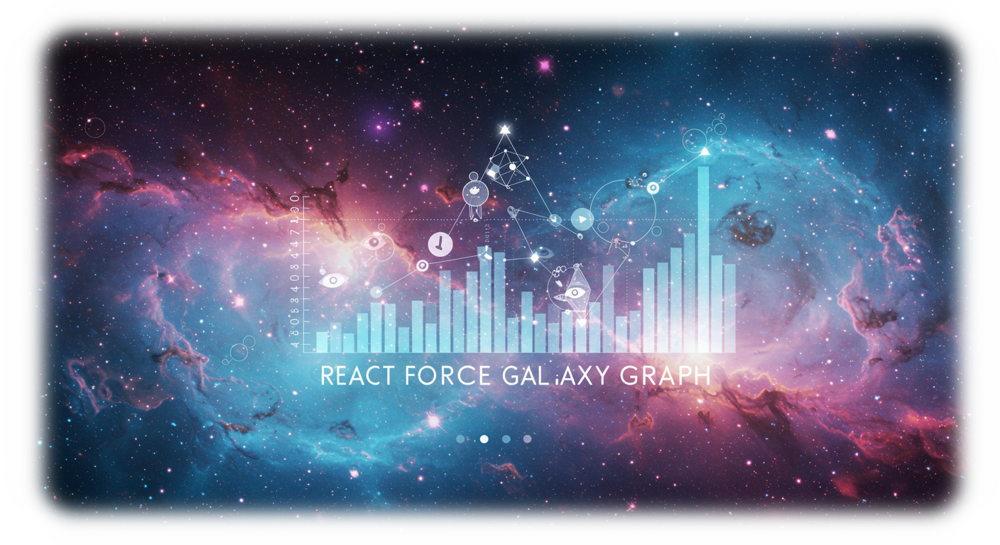

# react-force-galaxy-graph

メモリデータとLes Misérablesデータを表示するグラフビジュアライゼーション

## 機能

- メモリデータとLes Misérablesデータの視覚化
- 3D力学モデルによるインタラクティブな表示
- ブルームエフェクトを使用した美しい視覚表現
- データのダウンロード機能
- メモリデータの自動変換機能

## 始め方

1. リポジトリをクローン:
   ```bash
   git clone https://github.com/yourusername/react-force-galaxy-graph.git
   cd react-force-galaxy-graph
   ```

2. Webサーバーでexampleディレクトリを起動:
   ```bash
   cd example
   # お好みのWebサーバーを使用
   npx serve
   # または
   python -m http.server
   ```

3. ブラウザで`http://localhost:5000`（またはサーバーが表示するURL）にアクセス

## データ変換

memory.json形式のデータをmiserables.json形式に変換する処理はアプリケーション内に実装されています。アプリケーションは自動的にmemory.jsonを読み込み、グラフ表示用のフォーマットに変換します。

## アプリケーション構造

- `datasets/`: データファイル
  - `memory.json`: 元のメモリデータ
  - `miserables.json`: Les Misérablesデータ

- `example/`: アプリケーション
  - `app.jsx`: メインアプリケーションコード（React）
  - `index.html`: HTMLエントリポイント
  - `styles/app.css`: スタイルシート
  - `scripts/`: 変換スクリプト（Node.js環境用）

## アーキテクチャ

アプリケーションは単一ファイルのReactアプリケーションとして設計されています。主要なコンポーネントは:

1. **App**: メインのアプリケーションコンテナ
2. **Graph**: 3Dフォースグラフの描画を担当
3. **ControlPanel**: データセット選択とダウンロード機能を提供

データは以下のように処理されます:
1. JSONデータの読み込み（メモリデータまたはLes Misérablesデータ）
2. データの変換（必要に応じて）
3. 3Dフォースグラフによる視覚化
4. ブルームエフェクトなどの視覚的な強化
